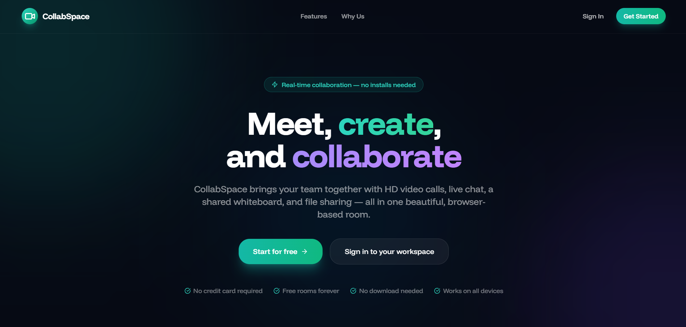
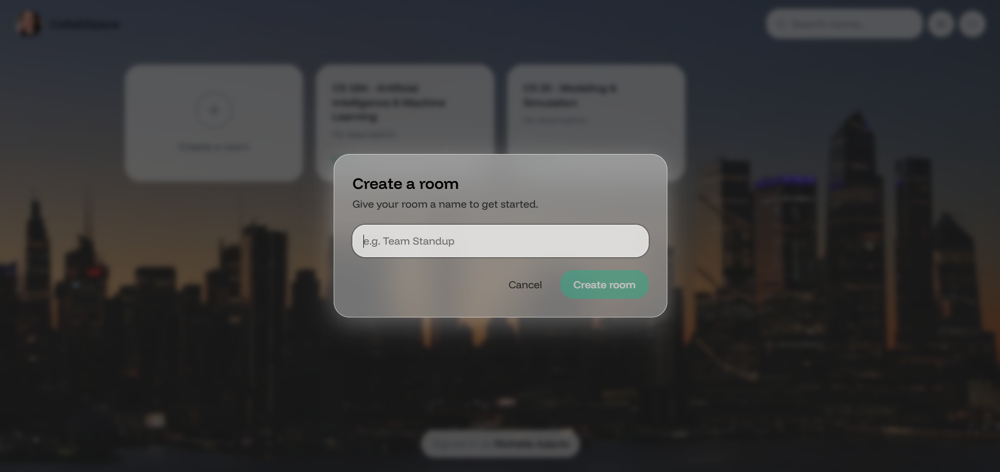
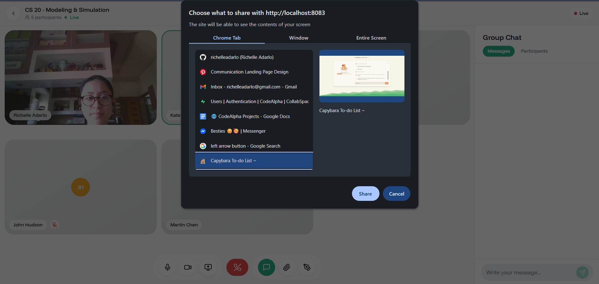
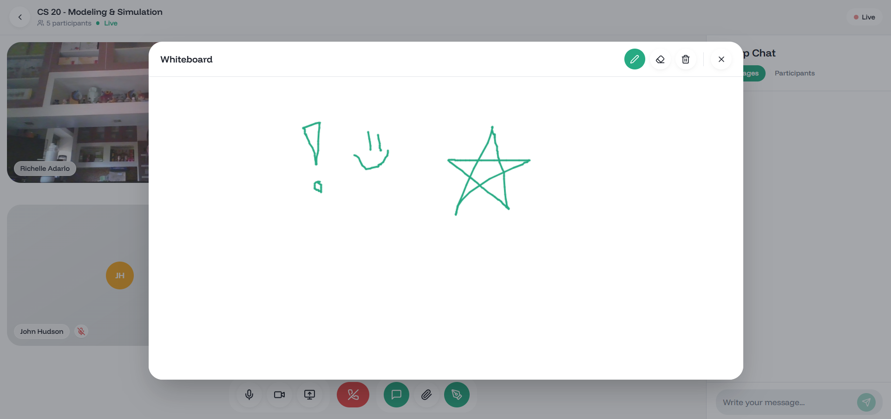

# 🎥 CollabSpace | Real-time Communication App

A full-stack real-time communication app (similar to Zoom/Google Meet) with video conferencing, screen sharing, and collaborative tools built for my CodeAlpha internship (task 4).

Visit the site live at: https://code-alpha-collabspace-communicatio.vercel.app/






## Tech Stack

### Frontend
- React (Vite)
- Tailwind CSS
- Socket.io Client
- WebRTC APIs

### Backend
- Node.js + Express
- MongoDB (Mongoose)
- JWT Authentication
- Socket.io
- Multer (file uploads)

---

## Features

- Multi-user video calling (WebRTC)
- Screen sharing during calls
- Real-time chat and signaling (Socket.io)
- File sharing within rooms
- Shared whiteboard for drawing and collaboration
- Create/join rooms with unique IDs
- User authentication (login/register)
- Secure API routes with JWT
- Live participant updates (join/leave)

---

## Getting Started

### Prerequisites
- Node.js (v18+)
- MongoDB (local or Atlas)

---

### 1️) Clone this Repo

```bash
git clone https://github.com/richelleadarlo/CodeAlpha_CollabSpace_Real-time-Communication_Richelle-Grace-Adarlo.git
cd collabspace
```

### 2) Setup Frontend + Backend

```bash
npm install
npm run dev
```

### 3) Environment Variables

Create a .env file in the backend folder:

```bash
MONGO_URI=your_mongodb_connection_string
JWT_SECRET=your_secret_key
PORT=5000
```

### 4) Project Structure
```bash
frontend/
  src/
    components/
    pages/
    App.jsx

backend/
  controllers/
  routes/
  models/
  middleware/
  server.js
```

##  How It Works

- **Authentication**  
  Users sign up and log in using JWT. Only authenticated users can access rooms.

- **Rooms**  
  Users create or join rooms with a unique ID. The server keeps track of participants.

- **Video & Audio (WebRTC)**  
  Users connect directly (peer-to-peer) and share their camera and microphone streams.

- **Signaling (Socket.io)**  
  Socket.io helps users connect by exchanging connection data (SDP & ICE candidates).

- **Screen Sharing**  
  Users can share their screen instead of their camera during a call.

- **Real-Time Features**  
  Socket.io handles:
  - User join/leave updates  
  - Chat messages  
  - Whiteboard syncing  
  - File sharing alerts  

- **Whiteboard**  
  A shared canvas lets users draw together in real time.

- **File Sharing**  
  Files are uploaded to the server and shared with others via links which they can also download.


Developed by Richelle Adarlo
