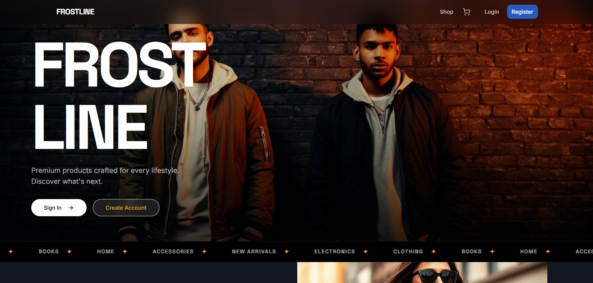

# Frostline | Full Stack E-Commerce Store 

A full-stack e-commerce web application built with React (TypeScript) on the frontend and Node.js + Express on the backend for my CodeAlpha internship (task 1).

Visit the site live at: https://code-alpha-frostline.vercel.app/



---

## Tech Stack

- **Frontend:** React + TypeScript (Vite), React Router, Context API, Axios
- **Backend:** Node.js, Express.js, MongoDB + Mongoose, JWT Auth
- **Dev:** nodemon, dotenv

---

## Features

- Product listings with search and category filter
- Product detail page
- Shopping cart (persisted in localStorage)
- User registration and login (JWT-based)
- Checkout with shipping address form
- Order history per user

---

## Getting Started

### Prerequisites

- Node.js v18+
- MongoDB running locally (or a MongoDB Atlas URI)

### 1. Clone the repo

```bash
git clone https://github.com/richelleadarlo/CodeAlpha_Frostline_Ecommerce_Richelle-Grace-Adarlo.git
cd ecommerce-app
```

### 2. Set up the backend

```bash
cd server
cp .env.example .env   # fill in your MONGO_URI and JWT_SECRET
npm install
npm run seed           # populate the database with sample products
npm run dev            # starts on http://localhost:8080
```

### 3. Set up the frontend

```bash
cd client
cp .env.example .env   # set VITE_API_URL=http://localhost:5000
npm install
npm run dev            # starts on http://localhost:8080
```

---

## Environment Variables

**`/server/.env`**
```
PORT=5000
MONGO_URI=mongodb://localhost:27017/ecommerce
JWT_SECRET=your_secret_here
NODE_ENV=development
```

**`/client/.env`**
```
VITE_API_URL=http://localhost:5000
```

---

## Project Structure

```
ecommerce-app/
├── client/          # React + TypeScript frontend
│   └── src/
│       ├── components/
│       ├── pages/
│       ├── context/
│       ├── services/
│       └── types/
└── server/          # Express.js backend
    ├── routes/
    ├── models/
    ├── middleware/
    └── seed/
```

---

## API Endpoints

| Method | Endpoint | Description | Auth |
|--------|----------|-------------|------|
| POST | `/api/auth/register` | Register a new user | No |
| POST | `/api/auth/login` | Login and receive JWT | No |
| GET | `/api/products` | List all products | No |
| GET | `/api/products/:id` | Get a single product | No |
| POST | `/api/orders` | Place an order | ✅ Yes |
| GET | `/api/orders` | Get user's orders | ✅ Yes |

---

## License

MIT

Developed by Richelle Grace Adarlo