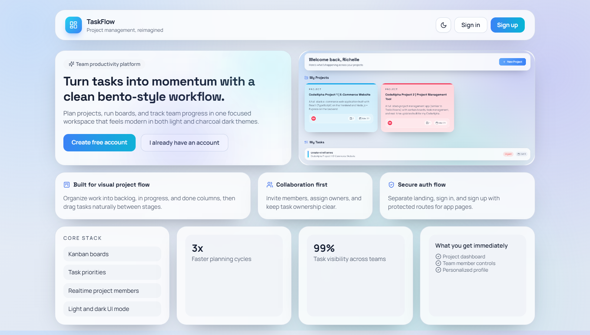
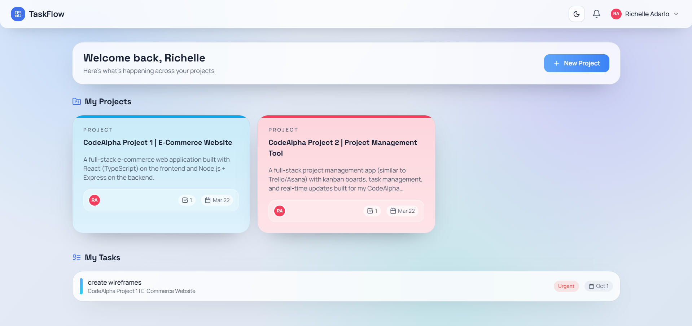
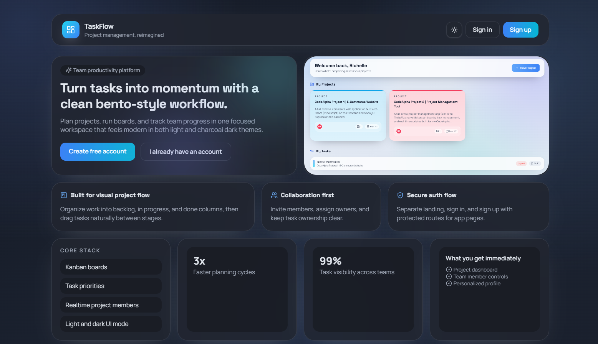
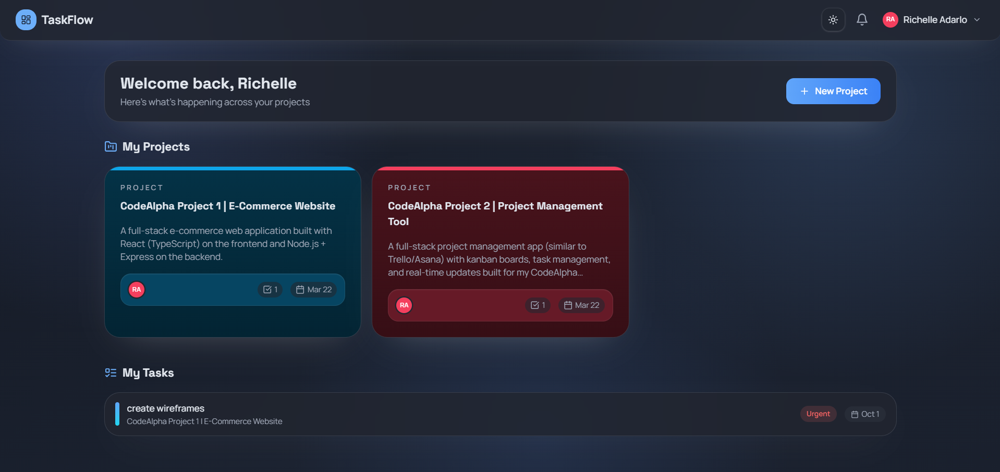

# 🗂️ TaskFlow | Project Management Tool

A full-stack project management app (similar to Trello/Asana) with kanban boards, task management, and real-time updates built for my CodeAlpha internship (task 3).

Visit the site live at: https://code-alpha-taskflow.vercel.app/






## Tech Stack

### Frontend
- React + TypeScript (Vite)
- React Router
- Context API
- Socket.io Client
- react-beautiful-dnd

### Backend
- Node.js + Express
- MongoDB (Mongoose)
- JWT Authentication
- Socket.io

---

## Features

- Kanban board with drag-and-drop
- Create projects and invite users
- Task details (assignees, due dates, labels, etc.)
- Comments with @mentions
- Real-time updates (no refresh needed)
- In-app notifications
- User profiles

---

## Getting Started

### Prerequisites
- Node.js (v18+)
- MongoDB (local or Atlas)

---

### Clone this repo

```bash
git clone https://github.com/richelleadarlo/CodeAlpha_TaskFlow_Project-Management-Tool_Richelle-Grace-Adarlo.git
cd project-management-app
```

Developed by Richelle Adarlo